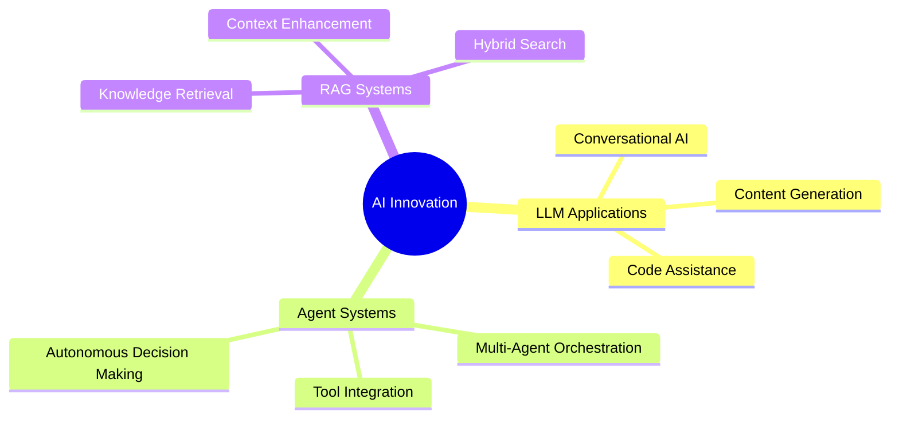

# 👋 Hello! I'm Starbuster2004

### 🚀 AI Enthusiast | 🤖 LLM Explorer | 🔬 RAG Researcher

---

## 🎯 About Me

> Passionate about **Generative AI**, **Large Language Models (LLMs)**, **Retrieval-Augmented Generation (RAG)**, and **AI Agents**. I'm constantly exploring innovative approaches to build intelligent, autonomous systems that can make a meaningful impact.

🔭 **Current Focus:** Building next-generation AI applications that combine the power of LLMs with real-world data  
🌱 **Learning Journey:** Deep diving into agent architectures, RAG systems, and advanced prompt engineering  
💡 **Mission:** Creating AI solutions that solve real problems and push the boundaries of what's possible

---

## 🌱 Currently Learning

<table>
<tr>
<td width="50%">

### 📚 Retrieval-Augmented Generation (RAG)
- Efficient integration of external knowledge bases with LLMs
- Vector database optimization and semantic search
- Advanced chunking and retrieval strategies
- Query transformation and re-ranking techniques

</td>
<td width="50%">

### 🤖 AI Agents & Tooling
- Multi-agent orchestration and collaboration
- Tool-using agents and function calling
- Memory systems for autonomous agents
- Decision-making frameworks and planning algorithms

</td>
</tr>
</table>

---

## 🚀 Projects and Interests

🎯 **Key Focus Areas:**

- **🧠 LLM-Based Applications:** Leveraging cutting-edge models like GPT-4, Claude, and Llama to streamline workflows and enhance productivity
- **🔗 Agent Orchestration:** Experimenting with LangGraph, AutoGPT, and custom frameworks for managing collaborative AI agents
- **📊 Knowledge Management:** Building intelligent systems that can retrieve, understand, and synthesize information from diverse sources
- **⚡ Performance Optimization:** Fine-tuning models, optimizing inference, and reducing latency in production systems

---

## 🛠️ Skills and Technologies

### 💻 Programming Languages

### 🤖 ML Frameworks & Libraries

### 🗄️ Vector Databases & Storage

### 🔧 Tools & Platforms

### ☁️ Cloud & Deployment

---

## 📊 GitHub Analytics

---

## 🏆 GitHub Trophies

---

## 💬 Let's Connect & Collaborate

I'm always excited to discuss **AI innovations**, collaborate on **cutting-edge projects**, and learn from fellow enthusiasts in the AI/ML community. Whether you're working on LLMs, building AI agents, or exploring RAG systems, I'd love to connect!

### 📫 Reach Out

### 🤝 Open to:

✅ Collaborating on AI/ML projects  
✅ Contributing to open-source initiatives  
✅ Discussing research ideas and implementations  
✅ Speaking opportunities and tech talks  
✅ Mentorship and knowledge sharing

---

### ⭐ Fun Fact

*"The best way to predict the future is to invent it... with AI!"* 🚀

---

**Thanks for visiting! Feel free to explore my repositories and don't hesitate to reach out. Happy coding! 💻✨**

